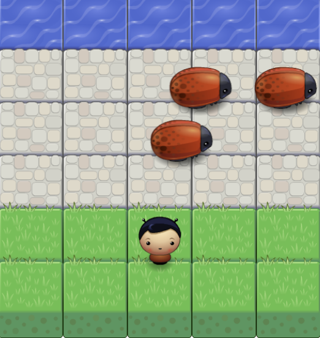
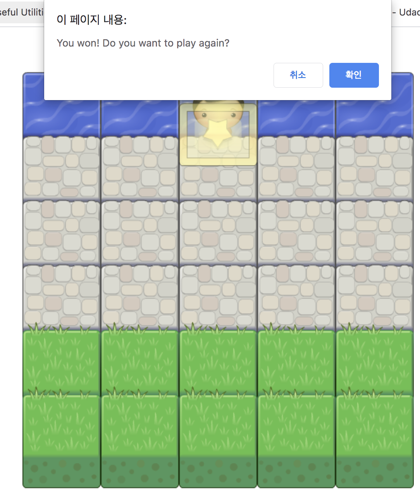

# Classic Arcade Game Clone Project

## About
This project is based on Udacity Frontend Nanodegree course. This is the #3 project, which is about classic arcade game.
- https://github.com/udacity/frontend-nanodegree-arcade-game

## How to play
- If you open the index.html file on web browser, the game starts automatically.
- You should move the character until you reach the water spot.
- If you collide with bugs, which are enemies, your character is sent back to the green yard.
- You wins if you get to the water without making collisions with enemies. You can play again if you check the confirm-popup after your victory! :)

## Screenshot
### On Game

### On Victory

